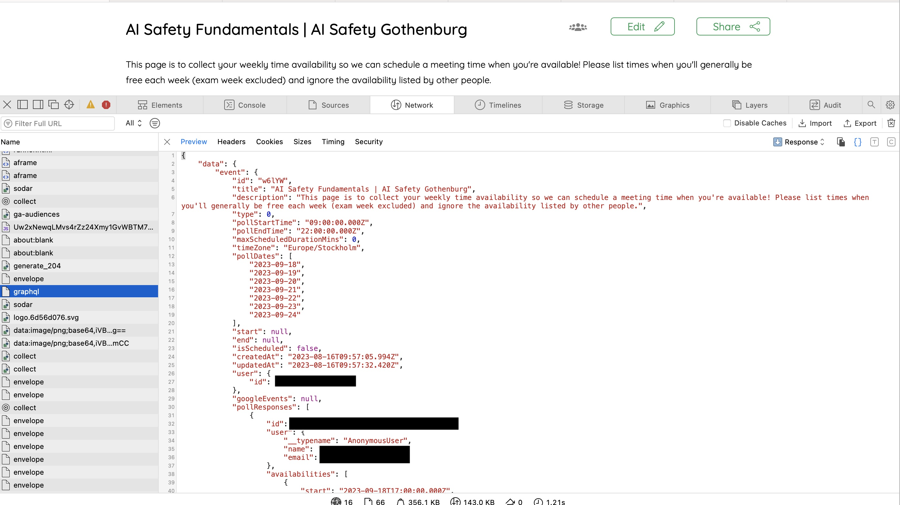

# Cohort-Formation-LettuceMeet

This repository facilitates the creation of cohorts from applicant availabilities submitted through LettuceMeet, specifically designed for groups organizing AI Safety Fundamentals courses in 2024 as part of the AI Safety Collab. However, with small modifications, it can be adapted for other programs or courses.

With many applicants in a LettuceMeet form it can be quite a frustrating process to create cohorts, as you can't select more than a half-hour block at a time while displaying which applicants are available. This script is meant to make that process easier. I have tried to make it as easy to use as possible for people who are not very familiar with Python, and the steps are otlined below for guidance. If you run in to any issues, feel free to shoot me a message on slack at Victor Wellsmo. 

### Step 1: Download respository
At the top of this page, press the green "<> Code" button, and then "Download ZIP" in the dropdown menu. Extract the files in the directory of your choice.

### Step 2: Extracting availability data from LettuceMeet
I’m not sure how much this differs between operating systems and browsers, but I think it’s similar (and easy to google). Here is how I do it in Safari.
For Safari on Mac
1. Open the LettuceMeet page displaying registered time availabilities.
2. Click on “Develop” in the menu bar, then select “Show Web Inspector”. (If you don't see “Develop”, follow [these instructions](https://support.apple.com/en-il/guide/safari/sfri20948/mac).
3. In the Web Inspector, navigate to the “Network” tab.
4. Look for entries named “graphql” under “Names”. You might need to refresh the page to see the correct entry. The one you're looking for should match the format shown below:

5. Copy the full contents, and paste it in a .json file (for example named "participant_availabilities.json"), in the same directory as you will run the python script. To see how the .json file should look, see [this](anonymized_file.json) anonymized file from AI Safety Gothenburgs applications last fall.

If you haven't already, make a separate LettuceMeet with entries for each of your group's facilitators time-availabilities. In the same way as for the applicants, make a .json file from the data (for example named facilitator_availabilities.json). The LettuceMeet form for the facilitators do not need to be on the same dates as the form for the participants, the availabilities will be matched based on weekday and time. 

### Generating cohorts
There are two different ways to generate cohorts. If all the applicants in the LettuceMeet data are applying for the same course, the easiest way is to simply open and run the file cohort_formation_GUI.py. This will open a window, as shown below:

